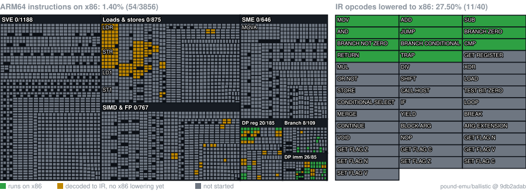

<h1 align="center">
  
    
  
  
    
  Pound
</h1>

<em>“i think of getting pounded when i see that [name]” – Satisfied Customer</em>

## Overview

**IMPORTANT: IN ORDER TO SQUEEZE AS MUCH PERFORMANCE FOR SWITCH 1 AND 2 EMULATORS, DEVELOPMENT HAS FULLY SHIFTED TO
CREATING A [NEW ARM RECOMPILER](https://github.com/pound-emu/ballistic) FROM THE GROUND UP. IF YOU ARE A COMPILER
DEVELOPER PLEASE GIVE US YOUR SUPPORT**

- [ ] Translate SM86 to SPIR-V to Vulkan.
- [X] Add `mimalloc` for host allocator.
- [ ] Create a custom pool / slab allocator for Horizon OS.
- [ ] Create a JIT code cache memory allocator for Ballistic.
- [ ] Create a JIT metadata manager.
- [ ] Integrate Ballistic into Pound.

<!-- POUND-STATUS:BEGIN -->
## Status

  

* ARM64: share of the 3856 A64 encodings in Ballistic's decoder table that its x86 tier-1 compiler can run (54 run, 201 decoded only, 3601 not started). Ballistic commit `9db2adab`.

GPU (SM86 to SPIR-V) and Horizon OS services are not started yet; they get their own panels once there is code to measure.
Regenerate with `python tools/status/generate_status.py --ballistic <path-to-ballistic-checkout>`.
<!-- POUND-STATUS:END -->

## Development

Pound actively supports Linux and Windows with the Clang compiler only. I cannot run Pound on Windows, so the Windows
builds will fall behind Linux builds. I would appreciate any Windows specific contributions greatly.